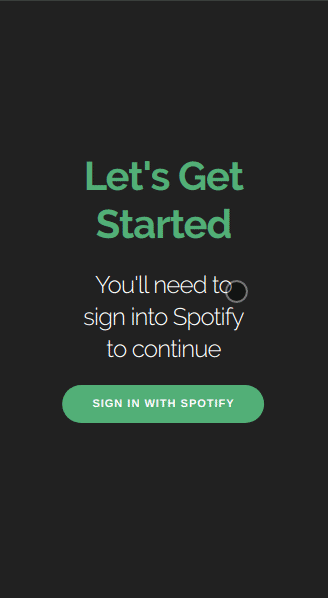
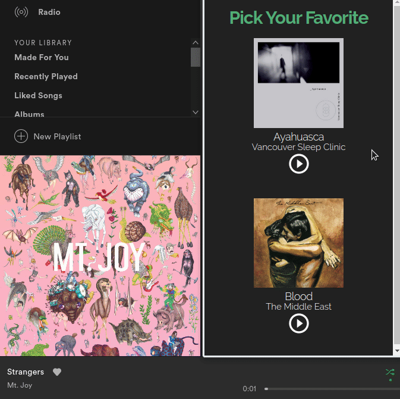

# Spotify User Data Quiz

## About
This is a simple react webapp which allows the user to see how well the spotify algorithms understand their taste in music. 
The user is prompted to answer a few this-or-that style questions then a score is calculated based on how closely the users answers match up with the Spotify user rankings.

## Demos
General navigation of the app 

(using chrome to emulate a mobile device, although the app also works on desktop I have designed the UI to look best on mobile)

The web-app uses Spotify's API to control the users spotify device remotely. It will control whatever Spotify has deemed to be the active device at that moment. It should also be noted that Spotify currently restricts remote control of devices to premium users only.

